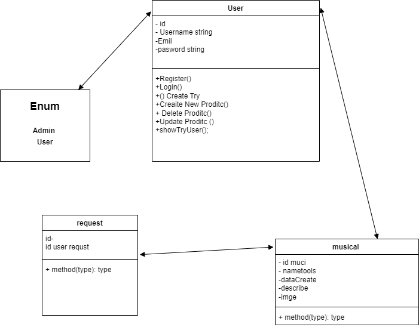

# Front-End Link 
(https://github.com/MUSABOMAIR293/Front-end.git)

# BackEnd

# Class Diagram

# Steup

1- Project Setup: installing Java, Spring Boot, and any necessary dependencies.

2- . Database Setup: Establish your database schema

3- Angualr Servic And compoent

# Technologies Used

1- Spring Boot DevTools

2- MySQL Driver

3- Spring Web

4- Spring Data JPA

5- Spring Security

6 - Mysql Databse

7 - Boostman

8 - Angualr

9 - Css

# Controllers and Routes structure

1- Controller Layer - RESTful API Endpoints: Develop RESTful API endpoints for the fundamental CRUD operations associated with your models. These endpoints include support for GET, POST, PUT/PATCH, and DELETE actions.

# Extra links

1- slide
(https://docs.google.com/presentation/d/1yPK87spkmAVcOiN7EBpj4G4f5JA6EVRB4-choSA611M/edit?usp=sharing)

2 - Trello
(https://trello.com/b/mKt5wI4g/final-project)

# Future Work

1-Create a page for the admin to add the machine, receive applications, delete accounts and modify them

2- Make a visitor profile, review and delete their application

3- Well designed login and registration interface

# Resources

https://stackoverflow.com/

Team Members
Just My
1- MuSaB Bin Omair
